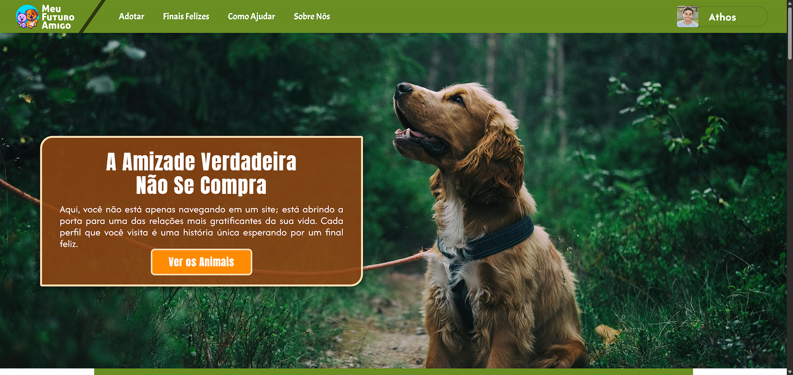
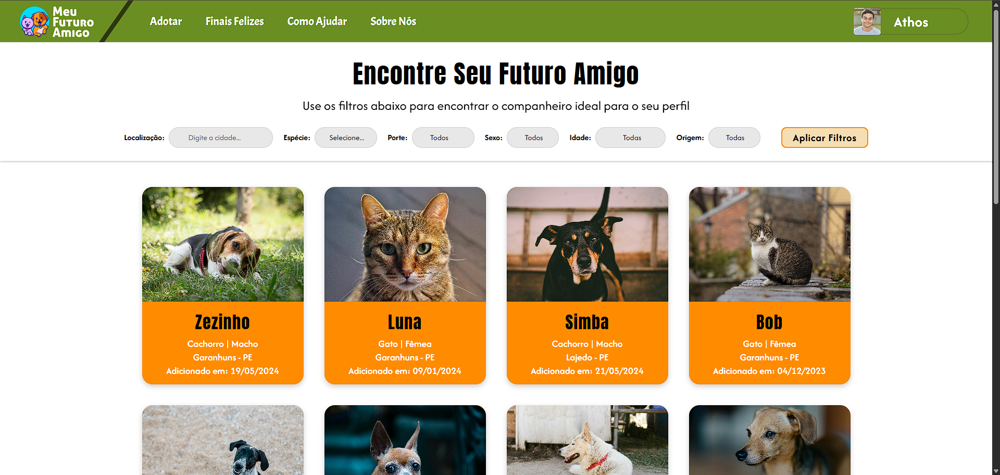
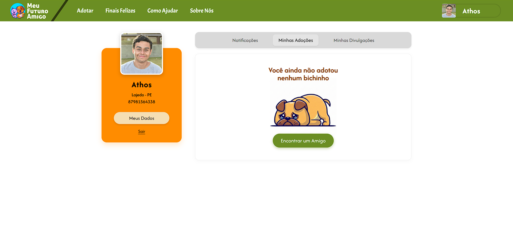

# 🐾 Meu Futuro Amigo

> **Status:** Aplicação Full Stack (Em Desenvolvimento)

> **Link da Página:** https://meu-futuro-amigo.onrender.com/

> **Usuário de Teste:** E-mail: anajulia@outlook.com <> Senha: ajulia2026 (Fique avontade para testar a plataforma).

## Introdução 

Uma plataforma completa de adoção de animais desenvolvida para conectar abrigos e protetores de Pernambuco a novas famílias. O sistema evoluiu de um protótipo estático para uma aplicação web robusta com **autenticação segura**, **banco de dados relacional** e **filtragem dinâmica**.

## Sobre o Projeto

O **Meu Futuro Amigo** soluciona a dificuldade de centralizar informações sobre animais disponíveis para adoção. Diferente de sites estáticos, esta aplicação gerencia o ciclo completo: desde o cadastro do usuário e login seguro, até a visualização detalhada dos animais com galerias interativas e controle de fila de interessados.

### Destaques Técnicos

* **Cloud Native:** A aplicação roda 100% na nuvem, garantindo disponibilidade e acesso remoto.
* **Arquitetura MVC:** Separação clara entre regras de negócio, rotas e visualização.
* **Performance:** Carregamento otimizado de imagens e filtragem de dados no *Client-side* para reduzir requisições ao servidor.
* **Segurança:** Implementação de Hashing de senhas e Tokens de recuperação com expiração automática.

---

## Infraestrutura e Deploy

O projeto não roda apenas localmente. Ele utiliza uma arquitetura moderna de hospedagem:

* **Aplicação (Back-end & Front-end):** Hospedada no **Render**, uma plataforma de nuvem (PaaS) que gerencia o ambiente Node.js e garante que o servidor esteja sempre ativo.
* **Banco de Dados:** Utiliza o **Neon**, um PostgreSQL **Serverless**. Isso garante escalabilidade automática e alta performance nas consultas, separando a computação do armazenamento.

---

## Stack Tecnológico

O projeto foi construído utilizando um ecossistema moderno de JavaScript:

### **Back-End (API & Server)**
* **Node.js & Express:** Servidor RESTful para gerenciamento de rotas (GET, POST, DELETE).
* **Autenticação:** Biblioteca `bcryptjs` para criptografia de senhas (Hash + Salt).
* **Uploads:** Middleware `multer` para processamento e armazenamento de imagens de perfil.
* **E-mail Service:** Integração com `nodemailer` para fluxo de "Esqueci minha senha".

### **Front-End (Interface)**
* **JavaScript (ES6+):** Manipulação avançada do DOM e consumo de API via `fetch`.
* **CSS3 Moderno:** Layout responsivo com Flexbox/Grid e variáveis CSS para tema.
* **Lógica de Filtros:** Algoritmo de filtragem multicritério (Cidade, Espécie, Porte) rodando no navegador.
* **Fancybox:** Integração para zoom e navegação em galeria de fotos.

### **Banco de Dados**
* **PostgreSQL:** Banco relacional para integridade dos dados.
* **Modelagem:** Relacionamentos 1:N (Um animal possui várias fotos) e gerenciamento de integridade referencial.

---

## Funcionalidades Principais

### Autenticação e Perfil
* **Login Seguro:** Comparação de Hash de senha no servidor.
* **Recuperação de Senha:** Geração de Token numérico de 6 dígitos com validade de 1 hora, enviado por e-mail.
* **Gestão de Conta:** O usuário pode atualizar dados cadastrais e foto de perfil (com preview em tempo real) ou excluir a conta definitivamente.

### Navegação e Adoção
* **Filtros Inteligentes:** O usuário pode cruzar dados (ex: "Gato" + "Filhote" + "Recife") e a lista se atualiza instantaneamente sem recarregar a página.
* **Paginação Responsiva:** Script que calcula quantos cards exibir por página baseado na largura da tela do dispositivo (`window.innerWidth`).
* **Página de Detalhes:** Exibição dinâmica de dados do banco, incluindo status de vacinação (Timeline CSS), galeria de fotos e contador de interessados na fila.

---

## Screenshots
**Filtros e Listagem:** Grid responsivo com cards informativos.
  

**Dashboard:** Edição de perfil e gerenciamento de dados.
  

## Design

O layout foi fielmente implementado com base no protótipo de alta fidelidade.
* **Protótipo no Figma:** [Acessar Projeto](https://www.figma.com/design/GDqz34u7yU78RZSstfax6A/Projeto-Web?node-id=0-1&t=Cj0maHrw5e0URM2f-1)
